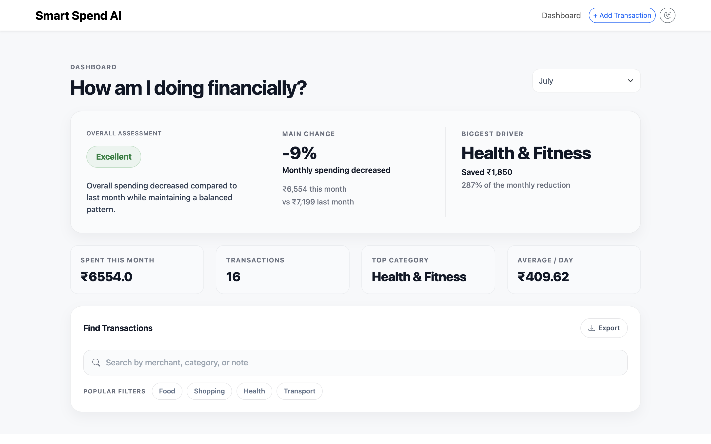

# Smart Spend AI

<div align="center">

### Understanding your money should be easier than spending it.

**An AI-powered Financial Intelligence Layer for modern payment platforms.**

Transform transaction history into meaningful financial insights that help people make better financial decisions—with less effort and complete control over their data.

---

*Designed to integrate with payment platforms, not replace them.*

</div>

---
## 🖼️ Product Preview

<p align="center">
  
</p>

## 📖 Product Overview

Modern payment platforms are exceptional at processing transactions.

They can tell you **what** you spent.

They rarely help you understand **why** you spent it.

Smart Spend AI bridges that gap.

It combines intelligent transaction categorization, financial analytics, behavioral insights, and explainable recommendations into a unified experience that transforms raw financial history into meaningful understanding.

Instead of replacing payment platforms, Smart Spend AI is designed as an **AI-powered Financial Intelligence Layer** that can integrate into them and make them smarter.

---

## 💡 Why Smart Spend AI?

Every financial decision begins with a simple question.

> **"Can I afford this?"**

Answering that question shouldn't require scrolling through months of transaction history.

Traditional finance applications often expect users to:

- Categorize every expense
- Maintain budgets manually
- Organize transactions
- Analyze spending patterns themselves

Smart Spend AI takes a different approach.

It believes financial understanding should emerge naturally from everyday spending.

The goal isn't to create more work.

The goal is to reduce it.

---

## ✨ Key Features

### 🧠 Financial Intelligence

- AI-powered transaction categorization
- Financial health analysis
- Monthly spending insights
- Spending trend detection
- Explainable financial recommendations
- Previous month comparison

---

### 💳 Transaction Management

- Add transactions
- Edit existing transactions
- Delete transactions
- Smart search
- Advanced filtering
- Category management

---

### 📊 Analytics & Insights

- Interactive dashboard
- Weekly spending visualization
- Monthly expense breakdown
- Category-wise analysis
- Financial Pulse score
- Spending summaries

---

### 📁 Data Management

- CSV export
- Local database storage
- Persistent transaction history
- Reliable data management

---

### 🎨 Modern User Experience

- Premium fintech-inspired interface
- Responsive design
- Light & Dark mode
- Beautiful charts
- Toast notifications
- Smooth interactions

---

## 🖼️ Screenshots

> *(Screenshots will be added here.)*

- Landing Page
- Dashboard
- Analytics
- Transaction Management
- Dark Mode
- Mobile View

---

## 🏗️ System Architecture

```
                 User
                   │
                   ▼
          Flask Web Application
                   │
      ┌────────────┴────────────┐
      │                         │
 Dashboard UI            Transaction Engine
      │                         │
      └────────────┬────────────┘
                   ▼
          Financial Intelligence
                   │
                   ▼
          SQLAlchemy ORM
                   │
                   ▼
               SQLite Database
```

---

## 🛠 Technology Stack

### Backend

- Flask
- SQLAlchemy
- SQLite

### Frontend

- HTML5
- CSS3
- JavaScript
- Bootstrap 5

### Visualization

- Chart.js

### Development Tools

- Git
- GitHub
- VS Code

---

## 🚀 Getting Started

### Clone the repository

```bash
git clone https://github.com/theanand108/smart_spend_AI.git

cd smart_spend_AI
```

### Create Virtual Environment

```bash
python -m venv venv
```

### Activate Environment

**Windows**

```bash
venv\Scripts\activate
```

**macOS / Linux**

```bash
source venv/bin/activate
```

### Install Dependencies

```bash
pip install -r requirements.txt
```

### Run the Application

```bash
python app.py
```

Open your browser and visit:

```
http://127.0.0.1:5000
```

---

## 📂 Project Structure

```
smart_spend_AI/

├── app.py
├── models/
├── routes/
├── templates/
├── static/
│   ├── css/
│   ├── js/
│   └── images/
├── instance/
├── requirements.txt
└── README.md
```

---

## 🛣️ Roadmap

### ✅ Version 1

- Transaction Management
- Financial Dashboard
- Analytics
- Smart Categorization
- CSV Export
- Responsive UI
- Dark Mode

---

### 🚧 Future Plans

- AI Spending Coach
- Personalized Financial Insights
- Budget Prediction
- Receipt OCR
- Bank API Integration
- Multi-user Accounts
- Cloud Synchronization
- Mobile Application

---

## 📚 Documentation

- Product Identity
- Product Design Document
- UI Design Philosophy
- Architecture Documentation

---

## 🤝 Contributing

Contributions, suggestions, and feedback are always welcome.

If you'd like to improve Smart Spend AI:

1. Fork the repository
2. Create a feature branch
3. Commit your changes
4. Open a Pull Request

---

## 📜 License

This project is licensed under the MIT License.

---

<div align="center">

### Smart Spend AI

**Understanding your money should be easier than spending it.**

Built with ❤️ to make financial understanding simple, intelligent, and accessible.

</div>
