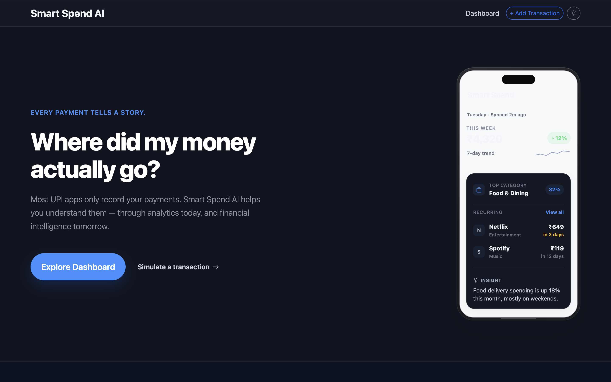
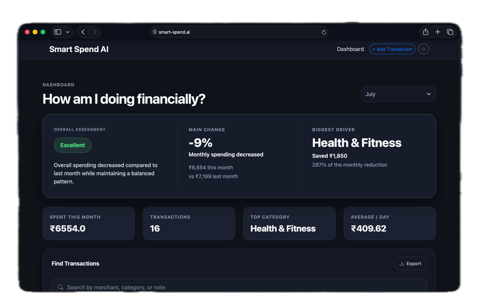
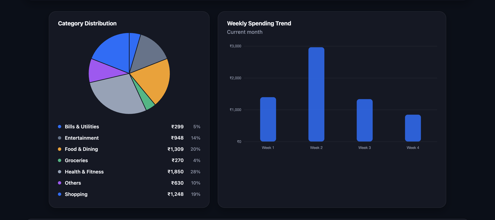
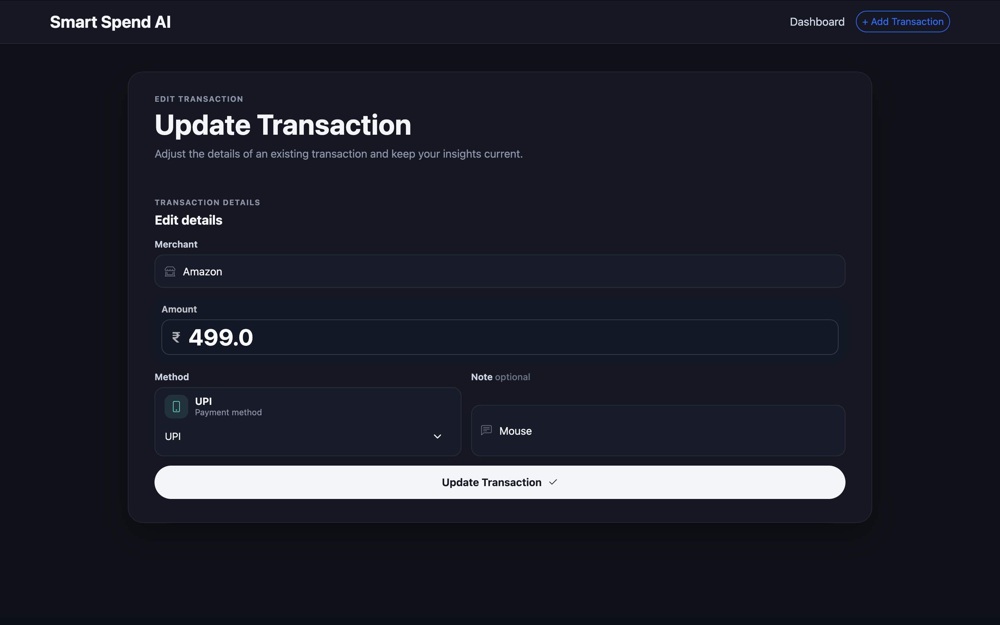
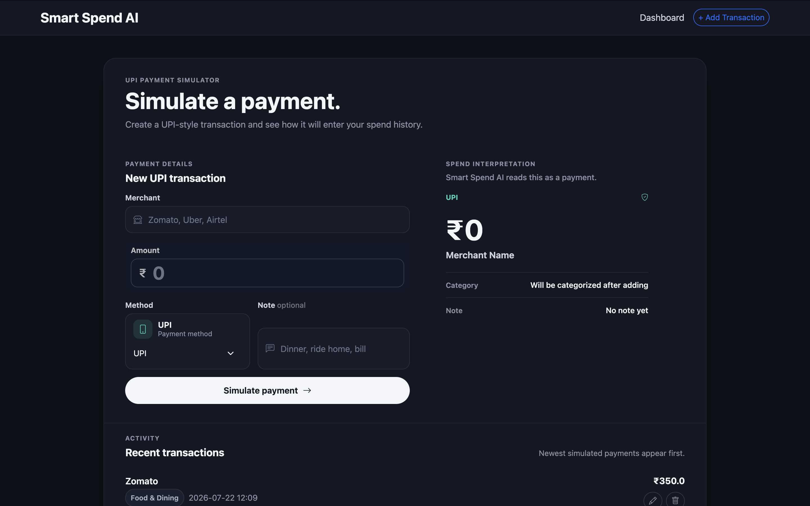
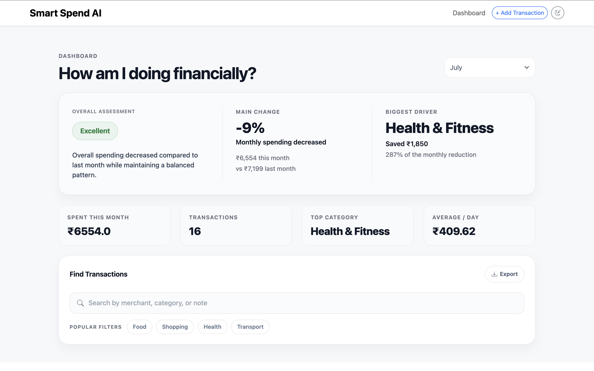

<div align="center"><h1>Smart Spend AI</h1>

### Understanding your money should be easier than spending it.

**An AI-powered Financial Intelligence Layer for modern payment platforms.**

Transform transaction history into meaningful financial insights that help people make better financial decisions—with less effort and complete control over their data.

---

*Designed to integrate with payment platforms, not replace them.*

</div>

## 🌐 Live Demo

**Try Smart Spend AI here:**

👉 **[Launch Smart Spend AI](https://smart-spend-ai-toiv.onrender.com)**

---
## 🖼️ Product Preview

<p align="center">
  
</p>

## 📖 Product Overview

Modern payment platforms are exceptional at processing transactions.

They can tell you **what** you spent.

They rarely help you understand **how your spending changes over time**.

Understanding your financial habits shouldn't require scrolling through months of transaction history or manually categorizing every expense.

Smart Spend AI bridges that gap.

It combines intelligent transaction categorization, financial analytics, behavioral insights, and explainable recommendations into a unified experience that transforms raw financial history into meaningful understanding.

Instead of replacing payment platforms, Smart Spend AI is designed as an **AI-powered Financial Intelligence Layer** that can integrate into them and make them smarter.

---

## 💡 Why Smart Spend AI?

Every financial decision begins with a simple question.

> **"Can I afford this?"**

Answering that question shouldn't require scrolling through months of transaction history.

Traditional finance applications often expect users to:

- Categorize every expense
- Maintain budgets manually
- Organize transactions
- Analyze spending patterns themselves

Smart Spend AI takes a different approach.

It believes financial understanding should emerge naturally from everyday spending.

The goal isn't to create more work.

The goal is to reduce it.

---

## 🎯 Product Principles

Smart Spend AI is guided by a few simple principles that shape every product decision.

- **Understanding over bookkeeping** — Users shouldn't have to manually recreate transaction history to understand their spending.
- **Insights over dashboards** — Charts explain the past; actionable insights help users make better financial decisions.
- **Progressive intelligence** — The product becomes more valuable as transaction history grows, delivering increasingly personalized insights over time.
- **Assist, never overwhelm** — AI should simplify financial understanding, not create unnecessary complexity or notifications.
- **Designed to integrate, not replace** — Smart Spend AI is envisioned as a financial intelligence layer for existing payment platforms, not another standalone expense tracker.

---

## ✨ Key Features

### 🧠 Financial Intelligence

- Intelligent transaction categorization
- Financial health analysis
- Monthly spending insights
- Spending trend detection
- Explainable financial recommendations
- Previous month comparison

---

### 💳 Transaction Management

- Add transactions
- Edit existing transactions
- Delete transactions
- Smart search
- Advanced filtering
- Category management

---

### 📊 Analytics & Insights

- Interactive dashboard
- Weekly spending visualization
- Monthly expense breakdown
- Category-wise analysis
- Financial Pulse score
- Spending summaries

---

### 📁 Data Management

- CSV export
- Local database storage
- Persistent transaction history
- Reliable data management

---

### 🎨 Modern User Experience

- Premium fintech-inspired interface
- Responsive design
- Light & Dark mode
- Beautiful charts
- Toast notifications
- Smooth interactions

---

## 🖼️ Screenshots

### Dashboard
  <p align="center">
  
</p>

### Analytics
  <p align="center">
  
</p>

### Transaction Management
<table>
<tr>
<td>

</td>

<td>

</td>
</tr>
</table>

### Light Mode
  <p align="center">
  
</p>

---

## 🛠 Technology Stack

### Backend

- Flask
- SQLAlchemy
- SQLite

### Frontend

- HTML5
- CSS3
- JavaScript
- Bootstrap 5

### Visualization

- Chart.js

### Development Tools

- Git
- GitHub
- VS Code

---

## 🏗️ System Architecture

```
                 User
                    │
                    ▼
            Flask Web Application
                    │
     ┌──────────────┴──────────────┐
     │                             │
HTML Templates              Analytics Engine
(Jinja2)                           │
     │                     Financial Intelligence
     └──────────────┬──────────────┘
                    ▼
             SQLAlchemy ORM
                    │
                    ▼
            SQLite Database
```

---

## 🚀 Getting Started

### Clone the repository

```bash
git clone https://github.com/theanand108/smart_spend_AI.git

cd smart_spend_AI
```

### Create Virtual Environment

```bash
python -m venv venv
```

### Activate Environment

**Windows**

```bash
venv\Scripts\activate
```

**macOS / Linux**

```bash
source venv/bin/activate
```

### Install Dependencies

```bash
pip install -r requirements.txt
```

### Run the Application

```bash
python app.py
```

Open your browser and visit:

```
http://127.0.0.1:5000
```

---

## 📂 Project Structure

```
smart_spend_AI/
│
├── app.py
├── requirements.txt
├── README.md
├── PRODUCT_DESIGN_DOCUMENT.md
│
├── src/
│   └── analytics/
│
├── static/
│   ├── dashboard.js
│   ├── style.css
│   ├── toast.js
│   └── ...
│
├── templates/
│   ├── index2.html
│   ├── dashboard.html
│   ├── update.html
│   └── ...
│
└── instance/ 
```

---

## 🛣️ Roadmap

- AI Financial Coach
- Recurring Payment Detection
- Spending Anomaly Detection
- Smart Budget Prediction
- Merchant Intelligence
- Personalized Spending Insights

### ✅ Current MVP

- Transaction Management
- Financial Dashboard
- Analytics
- Smart Categorization
- CSV Export
- Responsive UI
- Dark Mode

 **Demo Dataset**
>
> This repository includes a pre-populated SQLite database with sample transactions so the dashboard and analytics can be explored immediately. The data is for demonstration purposes only.

---

### 🚧 Planned Features

- AI Spending Coach
- Personalized Financial Insights
- Budget Prediction
- Receipt OCR
- Bank API Integration
- Multi-user Accounts
- Cloud Synchronization
- Mobile Application

---

## 📚 Product Philosophy

The complete product vision, roadmap, and design principles are available in **PRODUCT_DESIGN_DOCUMENT.md**.

---

## 🤝 Contributing

Contributions, suggestions, and feedback are always welcome.

If you'd like to improve Smart Spend AI:

1. Fork the repository
2. Create a feature branch
3. Commit your changes
4. Open a Pull Request

---

## 📜 License

This project is licensed under the MIT License.

---

<div align="center">

⭐ If you found Smart Spend AI interesting, consider giving this repository a star.

It helps others discover the project and supports future development.

Built with ❤️, curiosity, product thinking, and a lot of late nights.
</div>
